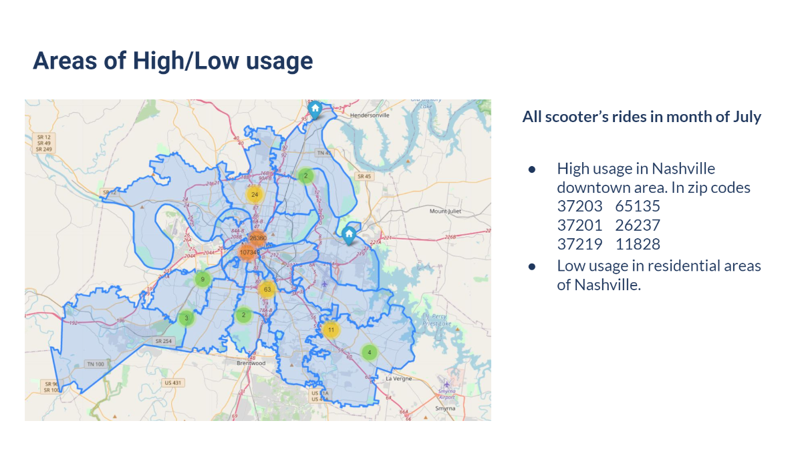
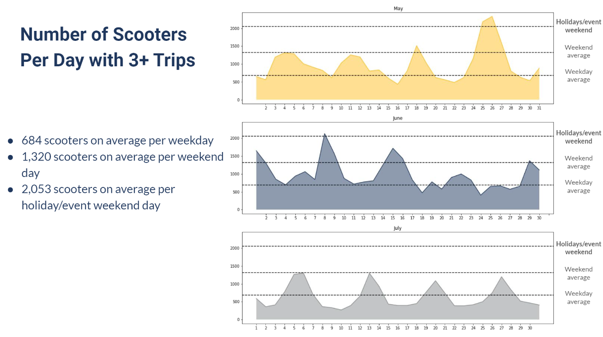
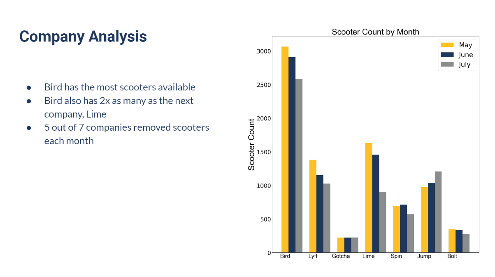
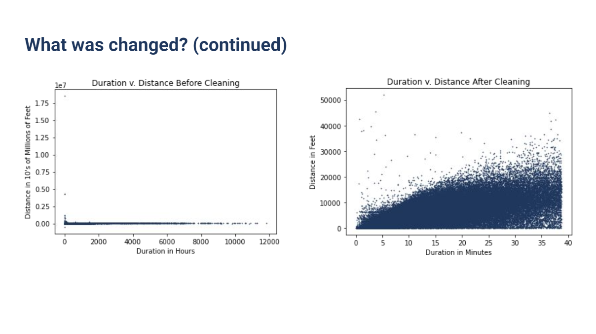
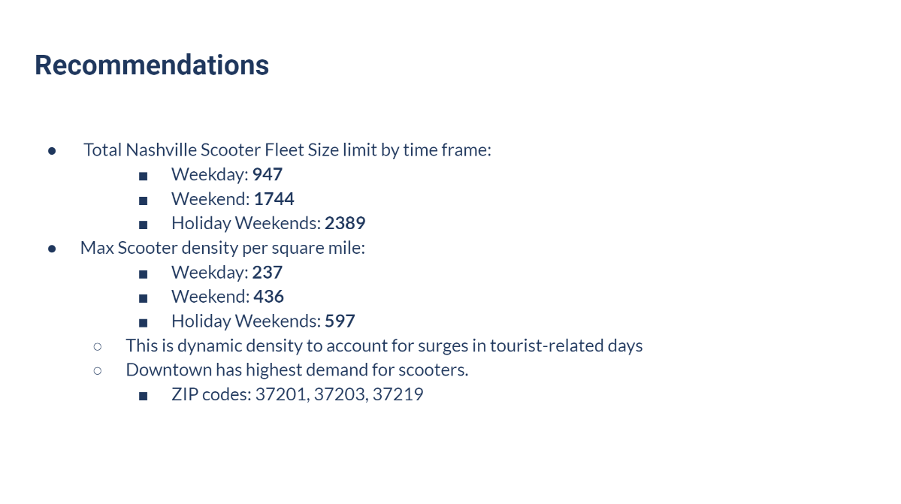

# Nashville's Scooter Solution

### Technologies Used
<b>Python:</b> Data cleaning, exploration, analysis, and charting  
<b>Google Slides:</b> Team presentation building, and exporting PDF used for GitHub

This project for me was less of a technical beast for me, and more of a project manager experience. The project started off with a bit of a surprise to me. While admittedly I was flattered, my class 'voluntold' me for the position of presentation lead. Being the first time we had ever had a project of this scale, this meant that I had 5 team leads under me, with 3-4 people under them. A total class of 24 students.

The over arching goal of this project, was to help clean up the streets of Nashville when it comes to scooter population & density, while also allowing for companies to continue to be economically successful in our city. 

The process of finding this answer resulted in a total of 54 slides (Feel free to view the PDF if trying to view on GitHub, and dont forget to hit 'View More Pages') discussing everything from how many companies we analyzed,  to how we reached our final conclusion.

## Screen grabs from the 54 page presentation

